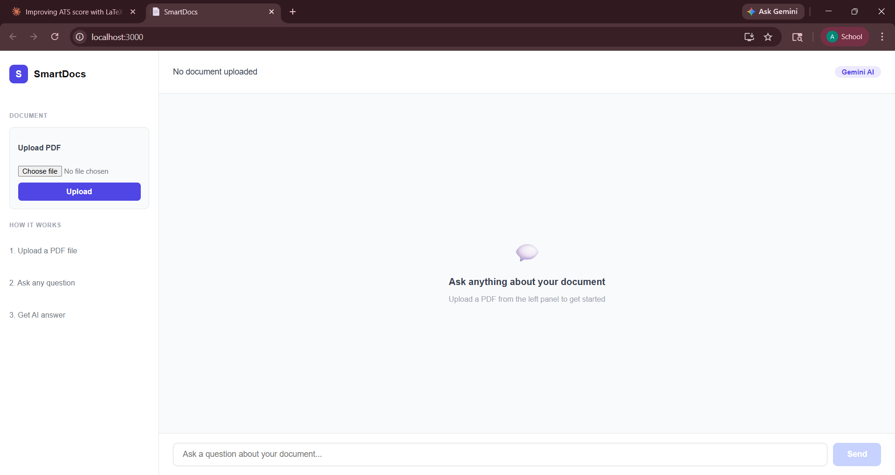
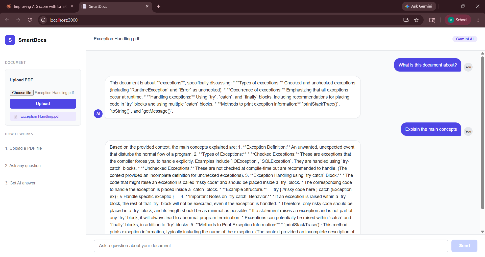
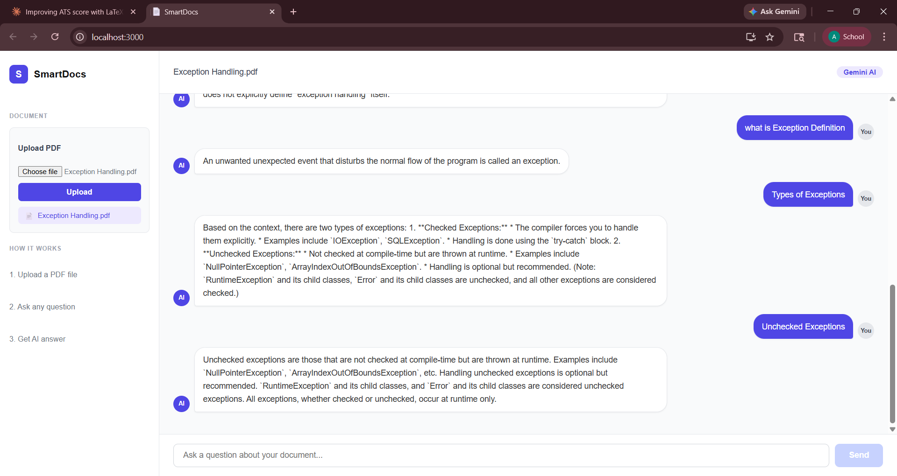

# SmartDocs - AI Powered Document Q&A System

An AI-powered web application where users can upload PDF documents and ask questions about them in natural language. The system finds the most relevant parts of the document and uses Google Gemini API to generate accurate answers.

Built using **Java Spring Boot** (backend) and **React.js** (frontend).

---

## Features

- Upload any PDF document
- Ask questions about the document in plain English
- AI-generated answers using Google Gemini API
- Relevant document chunks are found using TF-IDF and cosine similarity
- Clean chat-style interface
- File info saved to MySQL database

---

## How It Works

1. User uploads a PDF file
2. Backend extracts text using Apache PDFBox
3. Text is split into chunks of 500 characters
4. Each chunk is converted to a word frequency vector (TF-IDF style)
5. When user asks a question, cosine similarity is used to find the most relevant chunks
6. Top 3 matching chunks are sent to Gemini API as context
7. Gemini generates a natural language answer based on the context

---

## Tech Stack

**Backend**
- Java 21
- Spring Boot 3.2.5
- Spring Data JPA + Hibernate
- Apache PDFBox (PDF text extraction)
- Google Gemini API (AI answer generation)
- Gson (JSON parsing)
- MySQL

**Frontend**
- React.js
- Axios

**Tools**
- Maven
- Postman
- IntelliJ IDEA
- VS Code

---

## Project Structure

```
smartdocs/
├── backend/
│   └── src/main/java/com/smartdocs/ai/
│       ├── controller/
│       │   ├── DocumentController.java
│       │   └── UserController.java
│       ├── entity/
│       │   ├── Document.java
│       │   └── User.java
│       ├── repository/
│       │   ├── DocumentRepository.java
│       │   └── UserRepository.java
│       ├── service/
│       │   ├── DocumentService.java
│       │   ├── GeminiService.java
│       │   └── UserService.java
│       └── util/
│           ├── EmbeddingUtil.java
│           ├── PdfUtil.java
│           └── TextChunker.java
└── frontend/
    └── src/
        └── App.jsx
```

---

## How to Run

### Prerequisites
- Java 21
- Node.js
- MySQL
- Google Gemini API key (get it free from [makersuite.google.com](https://makersuite.google.com/app/apikey))

### Step 1 - Set up the database

Open MySQL and run:

```sql
CREATE DATABASE smartdocs_db;
```

### Step 2 - Configure backend

Open `src/main/resources/application.properties` and update:

```properties
spring.datasource.username=your_mysql_username
spring.datasource.password=your_mysql_password
```

Open `GeminiService.java` and add your API key:

```java
private final String API_KEY = "your_gemini_api_key_here";
```

### Step 3 - Run the backend

```bash
cd backend
mvn spring-boot:run
```

Backend will start on `http://localhost:8080`

### Step 4 - Run the frontend

```bash
cd frontend
npm install
npm start
```

Frontend will start on `http://localhost:3000`

---

## API Endpoints

| Method | Endpoint | Description |
|--------|----------|-------------|
| POST | /api/docs/upload | Upload a PDF file |
| POST | /api/docs/ask | Ask a question about the document |
| POST | /api/users/signup | Register a new user |
| POST | /api/users/login | Login with email and password |

---

## Screenshots

> Home Page - Upload PDF



> Chat - Ask Questions



> AI Answer



---

## Notes

- Do not push `application.properties` with real credentials to GitHub
- Do not push `GeminiService.java` with your real API key to GitHub
- The Gemini API free tier allows up to 60 requests per minute
- PDF text extraction works best with text-based PDFs, not scanned images

---

## Author

**Aditya Sahu**
- LinkedIn: [linkedin.com/in/aditya-sahu1444](https://linkedin.com/in/aditya-sahu1444)
- GitHub: [github.com/adityasahu0412](https://github.com/adityasahu0412)
